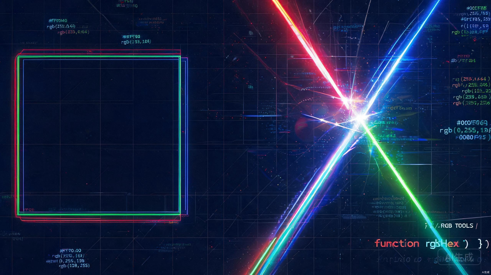

<div align="center">



# 🌈 Awesome RGB Toolkit

**A blazing-fast, neon-charged developer toolkit inspired by RGB aesthetics.**

*Built for those who code in full color.*

[](https://opensource.org/licenses/MIT)
[](https://github.com/2392480227h-rgb/awesome-rgb-toolkit/pulls)
[](https://github.com/2392480227h-rgb/awesome-rgb-toolkit)
[](https://github.com/2392480227h-rgb/awesome-rgb-toolkit/stargazers)

</div>

---

## 🚀 What is This?

**Awesome RGB Toolkit** is a collection of developer utilities, code snippets, and productivity boosters — all wrapped in a visually stunning RGB-themed package. Whether you're building web apps, CLI tools, or just want your terminal to look **absolutely fire** 🔥, this toolkit has something for you.

> **Philosophy:** Code should not only work great — it should *look* great too.

---

## ✨ Features

| Feature | Description | Status |
|---------|-------------|--------|
| 🎨 RGB Terminal Theme | Neon-styled terminal color schemes | ✅ Ready |
| ⚡ Quick Snippets | Copy-paste ready code snippets | ✅ Ready |
| 🔧 Dev Tools | Handy CLI utilities for daily dev | ✅ Ready |
| 📦 Project Templates | Starter templates with RGB flair | ✅ Ready |
| 🌐 Web Components | Reusable UI components | ✅ Ready |
| 🤖 AI Prompts | Curated prompts for coding AI | ✅ Ready |

---

## 📦 Installation

```bash
# Clone the repo
git clone https://github.com/2392480227h-rgb/awesome-rgb-toolkit.git

# Enter the directory
cd awesome-rgb-toolkit

# You're ready to go! 🎉
```

---

## 🎮 Quick Start

### RGB Color Generator

```javascript
function generateRGB() {
  const r = Math.floor(Math.random() * 256);
  const g = Math.floor(Math.random() * 256);
  const b = Math.floor(Math.random() * 256);
  return `rgb(${r}, ${g}, ${b})`;
}

console.log(`%cYour color: ${generateRGB()}`, `color: ${generateRGB()}; font-size: 20px; font-weight: bold;`);
```

### Neon Terminal Banner

```python
def neon_banner(text, color="255,0,64"):
    reset = "\033[0m"
    neon = f"\033[38;2;{color}m"
    line = "═" * (len(text) + 4)
    print(f"{neon}╔{line}╗{reset}")
    print(f"{neon}║  {text}  ║{reset}")
    print(f"{neon}╚{line}╝{reset}")

neon_banner("AWESOME RGB TOOLKIT")
```

---

## 🛠️ Tech Stack

<div align="center">

| Category | Technologies |
|----------|-------------|
| **Languages** | `JavaScript` `Python` `TypeScript` `Shell` |
| **Tools** | `Git` `Node.js` `Python 3` `Docker` |
| **Style** | `RGB Neon` `Cyberpunk` `Synthwave` |
| **Deployment** | `GitHub Pages` `Vercel` `Netlify` |

</div>

---

## 📂 Project Structure

```
awesome-rgb-toolkit/
├── 📁 snippets/          # Code snippets collection
├── 📁 templates/         # Project starter templates
├── 📁 tools/             # CLI utilities
├── 📁 components/        # Reusable web components
├── 📁 themes/            # RGB color themes
├── 📁 prompts/           # AI prompt library
├── 📄 README.md          # You are here 📍
├── 📄 LICENSE            # MIT License
└── 🖼️ banner.jpg         # Awesome banner
```

---

## 🌟 Roadmap

- [x] Initial release with core features
- [ ] Interactive RGB color picker web app
- [ ] VS Code theme extension
- [ ] Terminal prompt (oh-my-zsh theme)
- [ ] Browser extension for color extraction
- [ ] AI-powered code snippet recommender
- [ ] Discord bot with RGB commands

---

## 🤝 Contributing

Contributions are what make the open-source community such an amazing place! Any contributions you make are **greatly appreciated**.

1. Fork the Project
2. Create your Feature Branch (`git checkout -b feature/AmazingFeature`)
3. Commit your Changes (`git commit -m 'Add some AmazingFeature'`)
4. Push to the Branch (`git push origin feature/AmazingFeature`)
5. Open a Pull Request

---

## 📄 License

Distributed under the MIT License. See [`LICENSE`](LICENSE) for more information.

---

## 💬 Connect

<div align="center">

**Made with ❤️ and way too much RGB by [@2392480227h-rgb](https://github.com/2392480227h-rgb)**

⭐ If this project helped you, give it a star!

`#CodeInFullColor` `#RGBEverything` `#NeonAesthetics`

</div>
